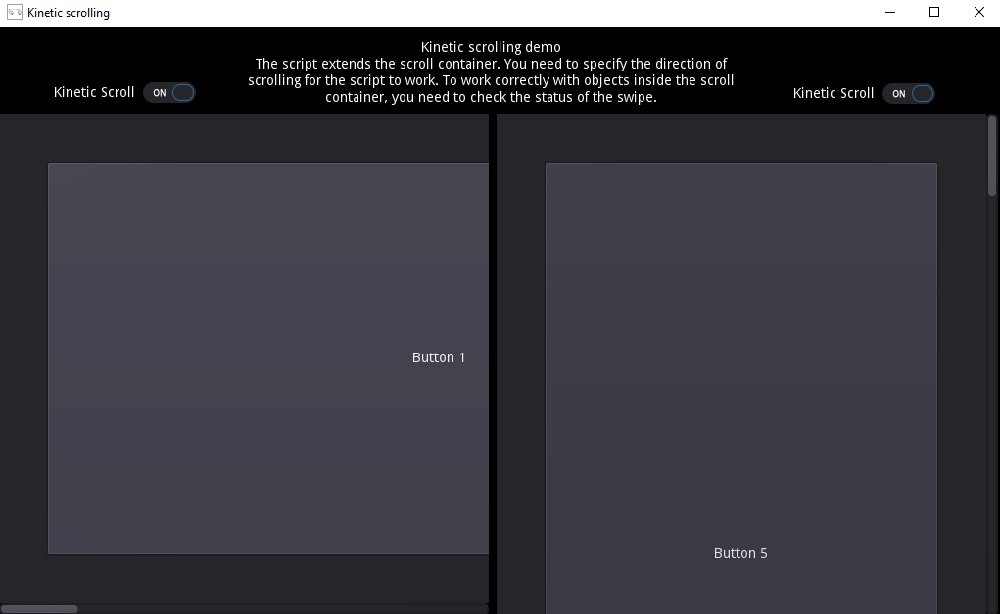

# Godot Kinetic scrolling

This script extends the Godot ScrollContainer - adds kinetic scrolling and swipe support. It works on PC and mobile devices. The ability to correctly work with objects inside the ScrollContainer is saved. Kinetic scrolling works correctly when using the mouse wheel. 

## How to use?
Just connect **ScrollContainer.gd** to the ScrollContainer. To work correctly with objects inside the ScrollContainer, you need to check the status of the scroll (variable "swiping"). Watch the demo.

The following **settings** are available: 
* Scroll Direction - variable determines the direction of the scroll;
* Kinetic Scroll Time - variable specifies how long it will continue scrolling;
* Kinetic Scroll Bias - variable determines the kinetic scroll length;
* Swipe Tolerance - variable determines which offset to consider as a swipe.

**Language:** GDScript

## Screenshots

## License

This script are distributed under the terms of the MIT license.